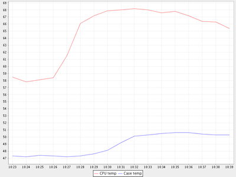
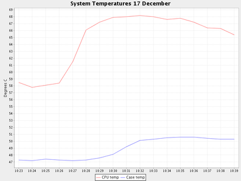
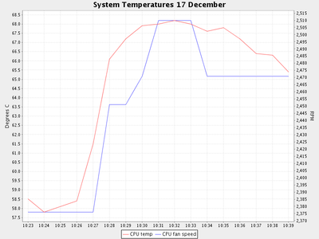
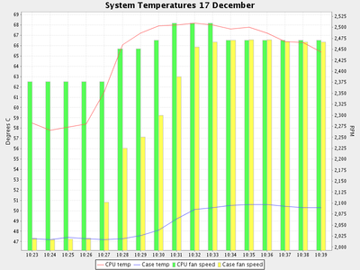
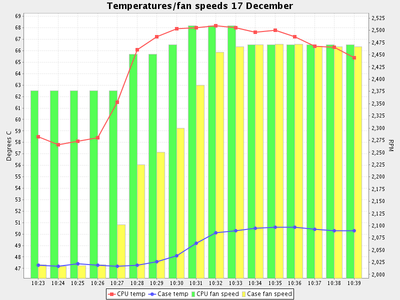
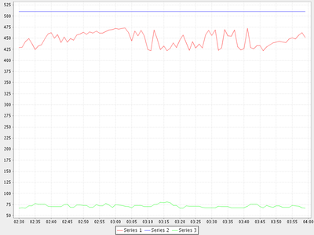
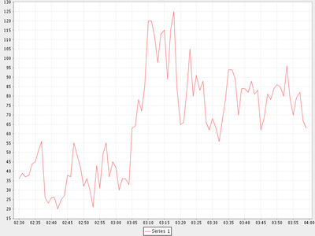
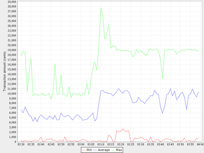
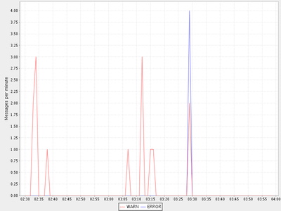
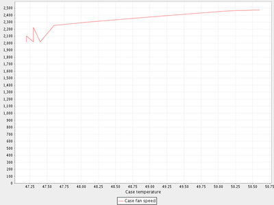

=====================
Quick Start Guide
=====================

Introduction
============

In the immortal words of the Python README, "If you don't read instructions,
congratulations on getting this far. :-)".

Many of these examples use data in the ``samples`` directory.

Installation
============

 1. Make sure you have `Java <https://www.oracle.com/java/technologies/downloads/>`_ installed
 2. Make sure you have `Python <http://www.python.org/>`_ installed
 3. Download the CLIChart zip file from the 
    `releases page <https://github.com/captsens/clichart/releases>`_ on Github, 
    and extract to a suitable directory
 4. Change to the top-level CLIChart directory you just unzipped, and install CLIChart by typing
    ``pip3 install clichart-x.y.z-py3-none-any.whl``, where the latter is the name of the (single) ``.whl`` file in the directory
    (``x.y.z`` is the version number).

    * On Linux you'll have to be root (or use sudo)
    * On Mac, you probably want to add the ``bin`` directory to your path, e.g. ``/Users/<you>/Library/Python/3.9/bin``

Test your installation by typing ``clichart -h`` at a command prompt - this should give you
the help screen.

See the `installation page <installation.html>`_ for further information.

Charting Pre-existing Data
==========================

Before you start, make sure that the CLIChart ``bin`` directory is in your path.  Type ``clichart -h`` at a command prompt - if
it doesn't show you a help screen, it's not in your path:

 * On Windows: ``set PATH=<pathToClichart\bin;%PATH%``
 * On Linux/Unix: ``export PATH=<pathToClichart/bin:$PATH``

In the samples directory, you'll find ``SystemTemps.csv``, which contains temperatures
and fan speeds from within a computer, recorded over 15 or so minutes.

First Step - A Basic Chart
--------------------------

Let's generate a very basic chart to see what the CPU and case temperatures did over time.  This is an
example of the second mode of operation for clichart - interactive with pre-existing tabular data. ::

    clichart -f -c -l 0,1,2 samples/SystemTemps.csv

And the result is a window showing the following graph (click to see the full-size chart):

Notes:

 * The options used are:

   - ``-f`` - The first row of data is column titles or headers
   - ``-c`` - The data is CSV (comma-separated value)
   - ``-l 0,1,2`` - The date or time is in column 0, and we want to plot the data in columns 1 and 2

 * Explore the top and popup menus.  The popup menu in particular allows control over most aspects
   of the chart.

Adding Titles and Saving to File
--------------------------------

Now, we'll embellish the chart a little, and instead of displaying it in a window we'll have it
saved to a PNG file: ::

    clichart -f -c -l 0,1,2 -t "System Temperatures 17 December" -y "Degrees C" \
            -o SystemTemps.png samples/SystemTemps.csv

The extra options are the chart title (``-t``), a title for the Y axis (``-y``), and the output
filename for the generated chart (``-o``).  The current directory now contains a file called
``SystemTemps.png``, which looks like this:

Management-Friendly Charts - The Second Axis
--------------------------------------------

We can all look at two charts and spot relationships between the two.  But sometimes you have to put
the two charts into one, to make the relationship obvious.  You often need a second Y axis for this.

The SystemTemps.csv file also includes fan speed information - let's plot that on the second axis, to
see if there's a relationship between CPU fan speed and CPU temperature.  Here's how: ::

    clichart -fcl 0,1 -t "System Temperatures 17 December" -y "Degrees C" \
            --columnlist2 3 --ytitle2 RPM samples/SystemTemps.csv

Note that all options for the second axis use long names, like ``--columnlist2``.  All options in
clichart support long forms, but the most common ones also have a short form, like ``-l``.

And here's the result:

Bar Charts
----------

It's often useful to use a bar chart (a histogram), particularly for discrete data such as counts.
clichart allows you to set either Y axis to display as a bar.

Let's turn the second axis in the previous example into a bar, by using the ``--bar2`` option: ::

    clichart -fcl 0,1,2 -t "Temperatures/fan speeds 17 December" -y "Degrees C" \
            --columnlist2 3,4 --ytitle2 RPM --bar2 samples/SystemTemps.csv

And the result is:

Other Embellishments
--------------------

You also get some control over the line weight (effectively the line or bar thickness for the chart),
and whether data points are displayed with shapes.  Here's the previous example, but with data points and
thicker lines: ::

    clichart -fcl 0,1,2 -t "Temperatures/fan speeds 17 December" -y "Degrees C" \
            --columnlist2 3,4 --ytitle2 RPM --bar2 \
            --datapoints --lineweight 2 --lineweight2 4 samples/SystemTemps.csv

And here's the result:

Charting Patterns in a Log File
===============================

In the samples directory, you'll find ``System.log``, which contains an extract of messages from
a server log.  We need to find out from the log file what the transaction rates were over the course
of the day, and how memory and thread usage varied.

Plotting Data - Memory and Threads
----------------------------------

Let's start with memory or threads.  These are an example of data that already exists in the log
file - we just need to extract it and put it into a suitable form.

Looking at the log file, you'll see there's a component called ``VMStatusLogger`` that logs
details of memory and thread use every minute, e.g. ::

    00:00:45,219 INFO  VMStatusLogger  Memory: 453.27 MB free, 510.43 MB total, Threads: 74 active

First, we'll use some UNIX commands to strip out the lines we're interested in and extract the data, then
we'll pipe the results to clichart to display ::

    grep VMStatusLogger samples/System.log \
        | awk '{print substr($1, 0, 5), $5, $8, $12}' \
        | clichart -l 0,1,2,3

And the result is a window showing the following graph (click to see the full-size chart):

Notes:

 * We could have used cut instead of awk, or any scripting language (python, perl etc.)
 * Instead of using the ``substr`` function in awk, we could have told clichart to use the full time
   format, which in this case would have required the option ``-d HH:mm:ss,SSS``
 * If you're using Windows, Cygwin is your friend - it provides all these tools and more
 * The data is separated by whitespace, which is the default for clichart.

CLIChart provides a Python script called linestats, which we could use instead of awk and grep.  This
is a bit like using a sledgehammer to crack a walnut, but if you don't have access to the UNIX tools
(you fool!  why not?!), this will do the job.  Make sure you have Python installed to use this one. ::

    linestats -m VMStatusLogger -k s:0:5 -v f:4 -v f:7 -v f:11 \
            -l k,0:min,1:min,2:min samples/System.log \
            | clichart -l 0,1,2,3

The result is the same, although the extra power of linestats leads to a more complex command line.
Note, however, that linestats has other options that could be useful here, e.g. outputting as
CSV, or including a title line in the output (to get a nice legend on the chart).  See
`the linestats documentation <linestats.html>`_ for further information.

Well, memory and thread use looks OK - the red line (Series 1) is the amount of free memory inside the system,
so we're not about to run out any time soon.

Extracting Rates - Transactions
-------------------------------

Let's turn our attention to transactions.  In this case, the data in the logs isn't what we want to view -
instead, we're interested in seeing the rate at which things happen.  In other words, we first need
to summarise the data in the logs, then plot the statistics that result.

Each time a transaction is processed, the log contains a line like this: ::

    00:00:44,448 INFO  Transaction  A:100 C:0 R:0

We're interested in how many transactions the system is processing per minute.  What we really need to
do is:

 * Extract every Transaction line from the log
 * Extract the hour and minute timestamp from each line
 * For each different timestamp, output the number of times it occurs (which is the number of transactions
   for that particular minute).

This is where the linestats script comes into its own, although this example only uses a little of its
power.  One of the things it will do is output counts for each different key (a classifier for grouping
lines of data) occurs.

Here's an example of its output: ::

    linestats -m Transaction -k s:0:5 -l k:cnt,k samples/System.log | head
    36        02:30
    39        02:31
    37        02:32
    38        02:33
    44        02:34
    45        02:35
    51        02:36
    56        02:37
    26        02:38
    23        02:39

Notes:

 * The -m option specifies that we only include lines containing 'Transaction' (this is actually a
   regular expression, but we didn't need that power here)
 * The -k option 's:0:5' specifies that the key for each line is a substring from character 0
   (inclusive) to 5 (exclusive), in other words the hours and minutes in the timestamp
 * The -l option 'k:cnt,k' specifies the columns we want in the output - in this case,
   the count for the key, followed by the key itself.

So now we can feed this summary data into clichart to see what the system was really doing: ::

    linestats -m Transaction -k s:0:5 -l k:cnt,k samples/System.log | clichart -l 1,0

And the result is a window showing that the system was pretty busy from around 3:10 am:

As you can see, there's nothing like a chart for showing patterns in data!

We could also make the chart prettier by adding an option to linestats to feed column titles to clichart,
and add chart and axis titles to clichart.

Extracting Statistics
---------------------

The transaction rate in the previous example just touched the surface of the subject of extracting
summary data from logs.  Very often, there is one or more numeric value on certain lines in the
input, and you'd like statistics (minimum, maximum, average, total etc.) on those values.

As an example, consider the Transaction log lines in the previous example.  If we assume that the part of the line
starting with 'A:' contains the amount of the transaction (in cents, perhaps), we might want
to know the minimum, average and maximum transaction amounts for every minute over the course of the day.

By now it will come as no surprise to find that linestats is your friend.  But since we're asking it
to do more work, its command line is more complex.  We've also taken the opportunity to add some column
titles to make the clichart output prettier: ::

    linestats -m Transaction -k s:0:5 -v 'r:A:(\d+)' \
            -c -l k,0:min,0:av,0:max -f 'Timestamp, Min, Average, Max' samples/System.log \
            | clichart -cl 0,1,2,3 -f -y "Transaction amount (cents)"

And here's the result:

Notes:

 * The -v option specifies the field we want to generate statistics for.  Prefixing it with 'r:'
   makes it a regular expression, and the bracketed part (containing one or more digits) will be
   extracted as the field value.  Note the use of single quotes to protect it from the shell
 * The -l option 'k,0:min,0:av,0:max' specifies the output columns as the key itself (i.e. the timestamp),
   then the minimum, average and maximum values for field number 0 (i.e. the first -v option)
 * The -f option provides a first line (with column headings) to add to the output.  Note the matching
   -f option in clichart.

Extracting Statistics for Discrete Values
-----------------------------------------

In the previous examples we've looked at the rate at which events happened, and statistics for
numeric fields in the log.  Often, however, we have a field in the logs that contains discrete
values, and we're interested in the rate at which each of these values occurs.

A very common example of this would be to chart the number of ERROR and WARN messages in the log
per minute.  This gives a quick overview of problems in the system, which you can then drill into.
This requires a slightly different technique than previous examples, since we no longer know the columns to be
output from the data - instead, we expect to see one column for each discrete value in the field.

This time, instead of linestats we need another program from the CLIChart stable - discretestats.
You can probably guess what it's for, from the name.  ::

    discretestats -k s:0:5 -v f:1 -c samples/System.log \
            | clichart -cl 0,2,3 -f -y "Messages per minute"

And here's the result:

Notes:

 * The -v option specifies the field containing discrete values.  Prefixing it with 'f:' interprets this
   as field number 1
 * The -l option to clichart omits column number 1.  The output from discretestats has 4 columns: the
   timestamp key, and 1 column for each discrete value (INFO, WARN and ERROR).  We were only interested
   in the latter 2 of these, so we omitted column 1.

Another Example - Apache Log File
---------------------------------

System logs have all sorts of different date/time formats, and clichart allows you to specify the format
used in the log (see `clichart date formats`_ for details).

**Note:** This example isn't based on a file in the samples directory.

To show an example of this, we'll use an Apache log, whose standard date/time format looks something like
``16/Dec/2006:14:28:03``.  If your Apache log format is anything like mine, the date/time is the fourth
field (and has a "[" tacked on the front), while the URL requested is the seventh field.

Let's assume that you want to see how many times a minute a set URL is called.  This will require:

 * Grepping out the URL you're interested in (I'll assume that it's a static URL, so there's no need to
   worry about dynamic parameters)
 * Extracting the day, month, year, hour and minute from the date/time
 * Using linestats.py to count the occurrences
 * Passing the data to clichart, with the appropriate date format - see `clichart date formats`_.

And here's how it looks on the command line: ::

    grep /someurl /var/log/httpd/access_log \
        | awk '{print substr($4, 2, 17)}' \
        | linestats \
        | clichart -d "dd/MMM/yyyy:HH:mm"

You could do the same using linestats to replace grep and awk (useful if you're using Windows): ::

    linestats -m /someurl -k "r:\[(\d\d/.../\d\d\d\d:\d\d:\d\d:\d\d)" \
        /var/log/httpd/access_log \
        | clichart -d "dd/MMM/yyyy:HH:mm"

Notes:

 * The second example uses 2 regular expressions on linestats.  The first (the -m option) is to include
   only lines containing that URL, while the second uses a bracketed section to extract the part of the
   timestamp we want.  See the linestats documentation for details.
 * Note the quoting of the -d option to clichart.  This is for the benefit of Windows users, since Windows
   requires quoting of values containing colons.

Aggregating Existing Tabular Data
---------------------------------

So, now you've used the above techniques to extract and chart statistics from your log files, and every day you
have a new set of statistics files and charts to look at.  But you're a busy person, and it takes a while to
check all the charts every day.  And most days there's not much of interest anyway...

What you need is a way to aggregate data from the day-by-day statistics files, and chart that.  For example,
let's say you extract statistics on memory and thread usage every day, and save them to CSV files, as in the
earlier example.  If you had a chart showing some important summary data for all days, you could quickly
scan that to see if you need to drill into the detail charts.

Aggregate charts are also really useful for comparing each day with 'normal' (whatever normal is). They make
it very easy to spot long-term trends (like memory leaks).

This is where the `aggregate` script comes in handy.  Let's say we want to chart the total memory at the end
of each day, and the average and maximum thread count during the day.  For the purposes of the example,
we'll assume that the base data for each day is in a file called `System.log.yyyy-mm-dd.memoryThreads.csv`,
where `yyyy-mm-dd` is the log date, and that the columns are the date, memory free, total memory and threads.
In the simplest example, we use some unix tools to find the files and work out their dates, then we use
`aggregate` to extract a single line of summary data from each day, and append it to a summary file: ::

    for f in `find someDir -name "System.log.*.memoryThreads.csv"`; do
        logDate=`echo ${f:11:10}`
        aggregate -cf -p $logDate -l 2:last,3:av,3:max $f >> MemoryThreadsSummary.csv
    done

The summary file will contain a line for each day, looking something like this: ::

    ...
    2007-06-02, 37.9, 64.1, 93
    2007-06-03, 47.3, 62.5, 118
    ...

The file doesn't have any column headers, so we'll use the `seriestitles` option in clichart: ::

    clichart -cl 0,1,2,3 -d yyyy-MM-dd \
            --seriestitles "Total memory at end of day,Average threads,Max threads" \
            MemoryThreadsSummary.csv

See the `aggregate script documentation <aggregate.html>`_ for more information.

Charts without Dates/Times
==========================

clichart isn't limited to plotting data values against time - you can use values as the X axis, or nothing.  For
example, to return to our system temperatures, it seems like there might be a relationship between the
case temperature and the case fan speed.  So let's try plotting the speed against temperature, and find out. ::

    clichart -cfvl 2,4 -x "Case temperature" samples/SystemTemps.csv

And here's the result:

So it looks as if there is some sort of relationship, but it's not as smooth as we'd hoped (probably because
of my dodgy data...).

CLI Server Mode
===============

clichart can act as a command-line server, for embedding in another program or script.  You'd use this
mode when you have a number of charts to generate from a script, and you don't want the expense of
launching clichart anew for each chart.  See the `documentation on CLI server mode
<clichart.html#cli_server_mode>`_ for details and an example, as well as the
`cliserverlib documentation <cliserverlib.html>`_ for a Python driver for clichart in CLI server mode.

.. _`clichart date formats`: clichart.html#date_formats

